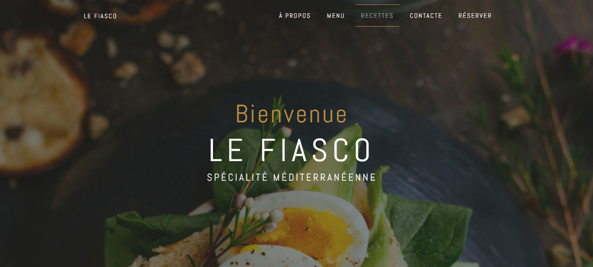
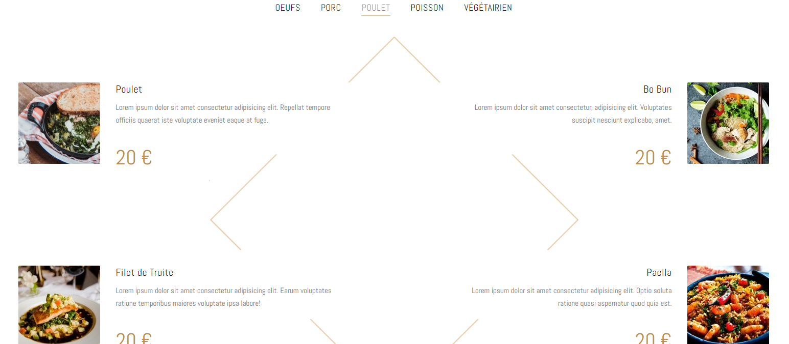

# :shrimp: Restaurant - Le Fiasco

Ce projet à été réalisé dans le cadre d'une formation de <a href = 'https://grafikart.fr/tutoriels/tp-restaurant-figma-1052' target = '_blank'>Grafikart</a> afin d'approfondir les bases du HTML et du CSS.

## Fonctionnalités

- **Présentation du Restaurant :** Découvrez l'ambiance et les spécialités méditerranéennes du restaurant.
- **Menu Détailé :** Explorez notre menu avec des sections dédiées pour chaque type de plat.
- **Section Recettes :** Accédez aux recettes populaires demandées par nos clients.
- **Design Moderne :** Une mise en page élégante et moderne pour mettre en valeur le site.
- **Responsive :** Compatible avec différents appareils pour une expérience utilisateur optimale.


### Technologies Utilisées


#### Mon Projet

Ce projet fut le premier réalisé grâce à Grafikart. Il m'a permis d'approfondir les bases en HTML & CSS. J'ai laisser cours a ma fantasie pour l'améliorer.

##### Comment Exécuter le Projet Localement

1. Clonez ce référentiel sur votre machine locale :
   ```bash
   git clone https://github.com/votre-utilisateur/votre-repository.git
   ```
2. Accédez au dossier du projet :
   ```bash
   cd votre-repository
   ```
3. Ouvrez le fichier `index.html` dans votre navigateur pour voir le site.





